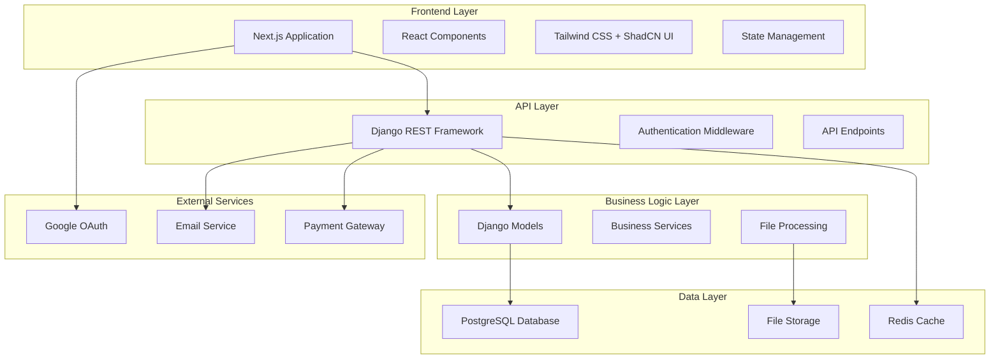
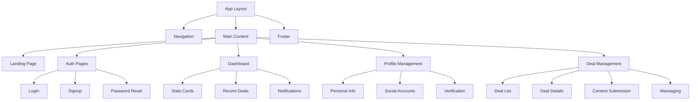
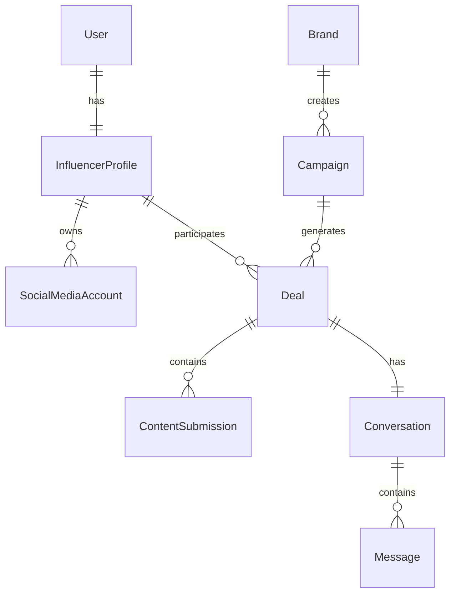

# Design Document

## Overview

The InfluencerConnect platform is designed as a full-stack web application using Next.js for the frontend and Django REST Framework for the backend. The architecture follows a decoupled approach where the Next.js frontend communicates with the Django backend through RESTful APIs. The system is designed to handle the complete influencer workflow from registration to deal completion and payment processing.

The platform emphasizes user experience with a responsive design, real-time notifications, and seamless file handling for content submissions. Security is paramount with JWT-based authentication, OAuth integration, and secure file storage.

## Architecture

### High-Level Architecture



### Technology Stack

**Frontend:**
- Next.js 15.4.4 with TypeScript
- React 19.1.0 for component architecture
- Tailwind CSS 4 for styling
- ShadCN UI for component library
- Axios for API communication
- React Hook Form for form management
- React Query for data fetching and caching

**Backend:**
- Django 4.2+ with Python 3.11+
- Django REST Framework for API development
- PostgreSQL for primary database
- Redis for caching and session management
- Celery for background tasks
- JWT for authentication
- Google OAuth for social login

**Infrastructure:**
- File storage for images and documents
- Email service for notifications
- CDN for static asset delivery

## Components and Interfaces

### Frontend Components Architecture



### Key Frontend Components

**1. Authentication Components**
- `LoginForm`: Email/password and Google OAuth login
- `SignupForm`: Multi-step registration with industry selection
- `PasswordReset`: Forgot password flow
- `EmailVerification`: Email verification handling

**2. Dashboard Components**
- `DashboardStats`: Statistics cards showing key metrics
- `RecentDeals`: List of recent deal invitations
- `NotificationCenter`: Real-time notifications
- `QuickActions`: Common action buttons

**3. Profile Management Components**
- `ProfileForm`: Personal information editing
- `SocialAccountManager`: Add/edit social media accounts
- `DocumentUpload`: Verification document handling
- `AddressManager`: Delivery address management

**4. Deal Management Components**
- `DealInvitationCard`: Individual deal invitation display
- `DealDetailsView`: Comprehensive deal information
- `ContentSubmissionForm`: File upload and content submission
- `MessagingInterface`: Real-time chat with brands
- `DealTimeline`: Visual timeline of deal progress

### Backend API Architecture

**1. Authentication APIs**
```python
# Authentication endpoints
POST /api/auth/signup/
POST /api/auth/login/
POST /api/auth/logout/
POST /api/auth/google/
POST /api/auth/forgot-password/
POST /api/auth/reset-password/
GET  /api/auth/verify-email/{token}/
```

**2. Profile Management APIs**
```python
# Profile endpoints
GET    /api/profile/
PUT    /api/profile/
POST   /api/profile/upload-document/
GET    /api/profile/social-accounts/
POST   /api/profile/social-accounts/
PUT    /api/profile/social-accounts/{id}/
DELETE /api/profile/social-accounts/{id}/
```

**3. Deal Management APIs**
```python
# Deal endpoints
GET  /api/deals/                    # List all deals
GET  /api/deals/{id}/               # Get deal details
POST /api/deals/{id}/accept/        # Accept deal
POST /api/deals/{id}/reject/        # Reject deal
POST /api/deals/{id}/submit-content/ # Submit content
GET  /api/deals/{id}/messages/      # Get messages
POST /api/deals/{id}/messages/      # Send message
```

**4. Dashboard APIs**
```python
# Dashboard endpoints
GET /api/dashboard/stats/           # Dashboard statistics
GET /api/dashboard/recent-deals/    # Recent deals
GET /api/dashboard/notifications/   # Notifications
```

## Data Models

### Core Models

**1. User and Profile Models**
```python
class InfluencerProfile(models.Model):
    user = models.OneToOneField(User, on_delete=models.CASCADE)
    phone_number = models.CharField(max_length=15)
    username = models.CharField(max_length=50, unique=True)
    industry = models.CharField(max_length=50, choices=INDUSTRY_CHOICES)
    bio = models.TextField(blank=True)
    profile_image = models.ImageField(upload_to='profiles/', blank=True)
    address = models.TextField()
    aadhar_number = models.CharField(max_length=12, blank=True)
    aadhar_document = models.FileField(upload_to='documents/', blank=True)
    is_verified = models.BooleanField(default=False)
    created_at = models.DateTimeField(auto_now_add=True)
    updated_at = models.DateTimeField(auto_now=True)
```

**2. Social Media Accounts**
```python
class SocialMediaAccount(models.Model):
    influencer = models.ForeignKey(InfluencerProfile, on_delete=models.CASCADE)
    platform = models.CharField(max_length=20, choices=PLATFORM_CHOICES)
    handle = models.CharField(max_length=100)
    profile_url = models.URLField(blank=True)
    followers_count = models.IntegerField()
    engagement_rate = models.DecimalField(max_digits=5, decimal_places=2)
    verified = models.BooleanField(default=False)
    is_active = models.BooleanField(default=True)
```

**3. Campaign and Deal Models**
```python
class Campaign(models.Model):
    brand = models.ForeignKey(Brand, on_delete=models.CASCADE)
    title = models.CharField(max_length=200)
    description = models.TextField()
    deal_type = models.CharField(max_length=20, choices=DEAL_TYPES)
    cash_amount = models.DecimalField(max_digits=10, decimal_places=2)
    product_value = models.DecimalField(max_digits=10, decimal_places=2)
    content_requirements = models.JSONField(default=dict)
    application_deadline = models.DateTimeField()
    campaign_start_date = models.DateTimeField()
    campaign_end_date = models.DateTimeField()

class Deal(models.Model):
    campaign = models.ForeignKey(Campaign, on_delete=models.CASCADE)
    influencer = models.ForeignKey(InfluencerProfile, on_delete=models.CASCADE)
    status = models.CharField(max_length=20, choices=DEAL_STATUS)
    invited_at = models.DateTimeField(auto_now_add=True)
    responded_at = models.DateTimeField(null=True, blank=True)
    completed_at = models.DateTimeField(null=True, blank=True)
```

**4. Content Submission Model**
```python
class ContentSubmission(models.Model):
    deal = models.ForeignKey(Deal, on_delete=models.CASCADE)
    platform = models.CharField(max_length=20)
    content_type = models.CharField(max_length=20)
    file_url = models.URLField(blank=True)
    caption = models.TextField(blank=True)
    submitted_at = models.DateTimeField(auto_now_add=True)
    approved = models.BooleanField(null=True)
    feedback = models.TextField(blank=True)
```

### Database Relationships



## Error Handling

### Frontend Error Handling

**1. API Error Handling**
```typescript
// Centralized error handling service
class ErrorHandler {
  static handleApiError(error: AxiosError) {
    if (error.response?.status === 401) {
      // Redirect to login
      router.push('/login');
    } else if (error.response?.status === 403) {
      // Show permission denied message
      toast.error('Permission denied');
    } else if (error.response?.status >= 500) {
      // Show server error message
      toast.error('Server error. Please try again later.');
    }
  }
}
```

**2. Form Validation**
- Client-side validation using React Hook Form
- Real-time validation feedback
- Server-side validation error display
- File upload validation (size, type, format)

**3. Network Error Handling**
- Retry mechanisms for failed requests
- Offline detection and messaging
- Loading states and error boundaries
- Graceful degradation for slow connections

### Backend Error Handling

**1. API Error Responses**
```python
# Standardized error response format
{
    "status": "error",
    "message": "Human readable error message",
    "code": "ERROR_CODE",
    "details": {
        "field_errors": {
            "email": ["This field is required"]
        }
    }
}
```

**2. Exception Handling**
- Custom exception classes for business logic errors
- Global exception handler for unhandled exceptions
- Logging and monitoring for error tracking
- Rate limiting and abuse prevention

**3. Validation Errors**
- Model-level validation
- Serializer validation
- Custom validators for business rules
- File upload validation and security checks

## Testing Strategy

### Frontend Testing

**1. Unit Testing**
- Component testing with React Testing Library
- Hook testing for custom hooks
- Utility function testing
- API service testing with mocked responses

**2. Integration Testing**
- Page-level testing
- Form submission flows
- Authentication flows
- File upload functionality

**3. End-to-End Testing**
- Critical user journeys (signup, deal acceptance, content submission)
- Cross-browser compatibility testing
- Mobile responsiveness testing
- Performance testing

### Backend Testing

**1. Unit Testing**
- Model testing with Django TestCase
- View testing with DRF APITestCase
- Service layer testing
- Utility function testing

**2. Integration Testing**
- API endpoint testing
- Database integration testing
- File upload and processing testing
- Authentication and authorization testing

**3. Performance Testing**
- Load testing for API endpoints
- Database query optimization testing
- File upload performance testing
- Caching effectiveness testing

### Test Data Management

**1. Fixtures and Factories**
- Django fixtures for test data
- Factory Boy for dynamic test data generation
- Seed data for development environment
- Test database isolation

**2. Mock Services**
- External API mocking (Google OAuth, payment gateways)
- File storage mocking for testing
- Email service mocking
- Background task mocking

### Continuous Integration

**1. Automated Testing Pipeline**
- Frontend tests run on every commit
- Backend tests with coverage reporting
- Integration tests in staging environment
- Performance regression testing

**2. Code Quality Checks**
- ESLint and Prettier for frontend
- Black and flake8 for backend
- TypeScript strict mode enforcement
- Security vulnerability scanning

This design provides a robust foundation for the influencer marketing platform with clear separation of concerns, comprehensive error handling, and thorough testing strategies. The architecture supports scalability and maintainability while ensuring a smooth user experience for influencers managing their brand collaborations.